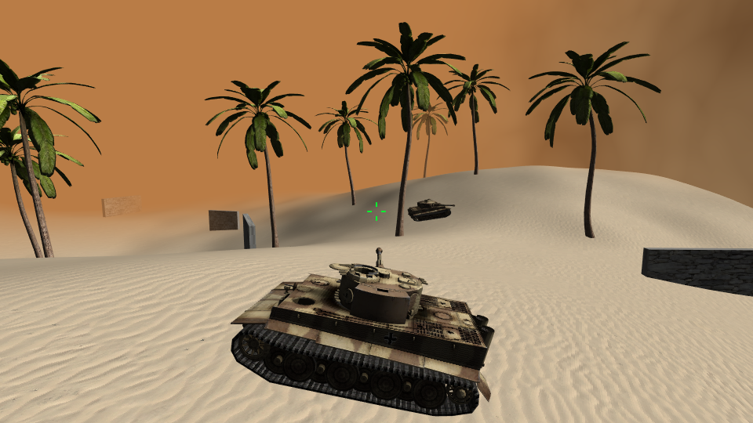

# CS4610 Final Project

Mizzou CS4610 final project built with custom WebGL engine with Cannon.js physics.



# Instructions

## Client

The client is regular javascript and requires no special setup to run. Simply host the files inside the client folder as a webserver and connect to it.

By default, the game mode is set to multiplayer with an ip address hard coded to a server that is most likely not running by the time you read. You must change the ip or change the game mode to multiplayer local or single player.

Search for "mode" in client/game/index.js and change it to the desired mode. The ip should be below the mode line.

## Server

The server is a node.js server with socket.io. To run it, run the following command:

```sh
node server.js
```

The client website has an endpoint "gameControlPanel" for starting and resetting the match. The default password is "27". For the control panel to connect to the server, the ip and game mode must also be changed. You can find that in client/gameControlPanel/index.js

Remember to also change the ip and game mode of the client so it can connect to the server.